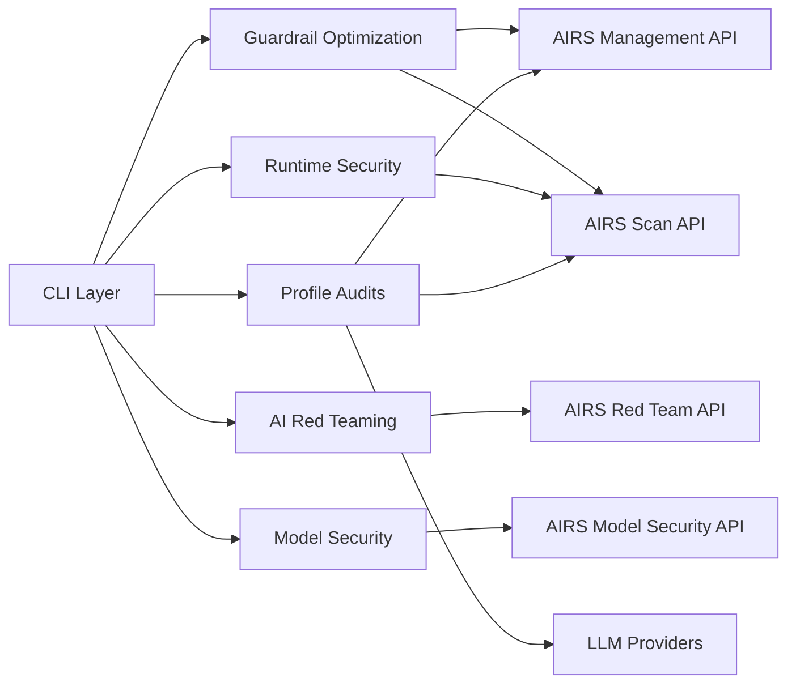
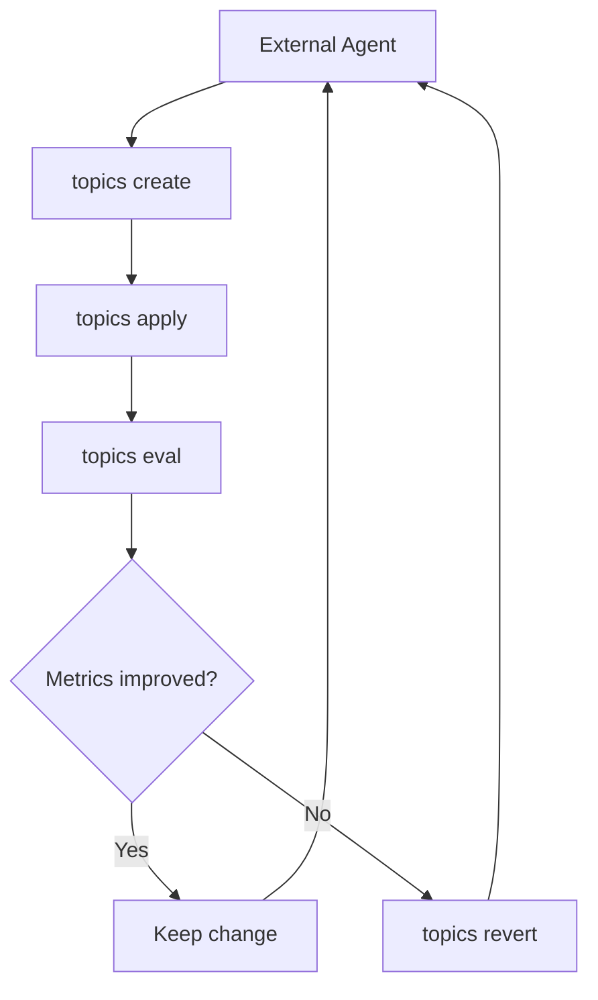
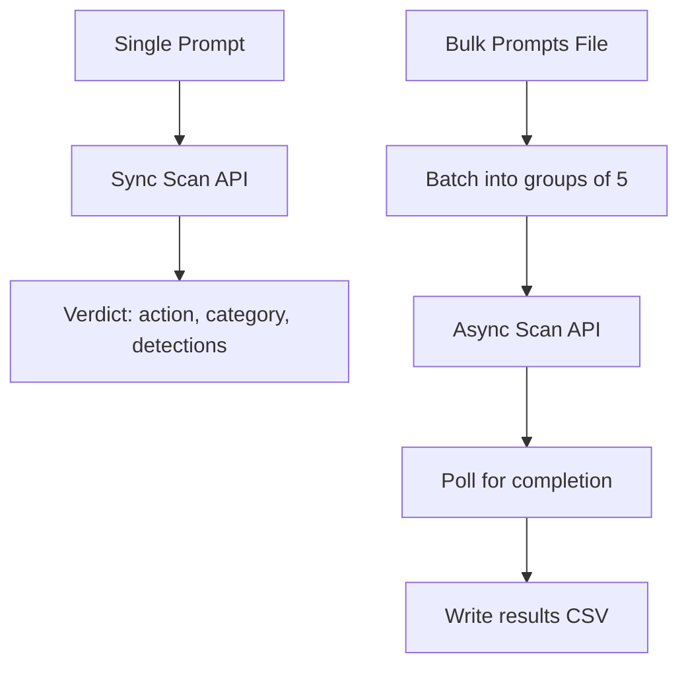

# Architecture Overview

Prisma AIRS CLI is a multi-capability CLI tool and library for Palo Alto Prisma AIRS. Each subsystem has a single responsibility and communicates through typed interfaces — the CLI layer orchestrates user interaction while service layers handle AIRS API communication.

## Module Structure

```
src/
├── cli/              Commands, interactive prompts, terminal rendering
├── config/           Zod-validated config schema + cascade loader
├── core/             Prompt loader, efficacy metrics, AIRS constraints
├── llm/              LangChain provider factory, structured output, prompts (used by audit)
├── airs/             Scanner, Runtime, Management, Red Team, Prompt Sets, Model Security
├── audit/            Profile-level multi-topic evaluation + conflict detection
├── report/           Structured evaluation reports (JSON/HTML)
└── index.ts          Library re-exports
```

## Capability Domains

Prisma AIRS CLI provides five capability domains, each backed by dedicated service and CLI layers:



| Domain | CLI Commands | Service Layer |
|--------|-------------|---------------|
| **Guardrail Optimization** | `runtime topics create`, `runtime topics apply`, `runtime topics eval`, `runtime topics revert` | Prompt loader + Scanner + Management |
| **Runtime Security** | `runtime scan`, `runtime bulk-scan`, `runtime profiles`, `runtime topics`, `runtime api-keys`, `runtime customer-apps`, `runtime deployment-profiles`, `runtime dlp`, `runtime scan-logs` | `SdkRuntimeService` (sync + async scan) + `SdkManagementService` (config CRUD) |
| **AI Red Teaming** | `redteam scan`, `redteam targets`, `redteam prompt-sets`, `redteam prompts`, `redteam properties` | `SdkRedTeamService` + `SdkPromptSetService` |
| **Model Security** | `model-security groups`, `model-security rules`, `model-security scans`, `model-security labels` | `SdkModelSecurityService` |
| **Profile Audits** | `runtime profiles audit` | Audit runner + Scanner + LLM |

## Guardrail Optimization Data Flow

The guardrail workflow uses atomic CLI commands orchestrated by an external agent (see `program.md`):



## Runtime Security Data Flow



## Modules at a Glance

| Module | What it does |
|--------|-------------|
| **`cli/`** | Commander CLI with 3 top-level command groups (`runtime`, `redteam`, `model-security`), Inquirer prompts, and Chalk terminal output |
| **`config/`** | Zod schema with coercion and defaults; cascade loader merges CLI flags, env vars, config file, and defaults |
| **`core/`** | CSV prompt loader, metric computation (TPR/TNR/F1), and AIRS constraint validation |
| **`llm/`** | Factory for 6 LangChain providers, structured output with Zod schemas (used by audit and eval renderer) |
| **`airs/`** | Scanner (sync scan + batched concurrency), Runtime (sync + async bulk scan with polling), Management (topic CRUD, profile CRUD, API keys, customer apps, deployment/DLP profiles, scan logs), Red Team (scan CRUD/polling/reports), Prompt Sets (custom prompt set management), Model Security (groups/rules/scans) |
| **`audit/`** | Profile-level multi-topic evaluation — generates tests per topic, computes per-topic and composite metrics, detects cross-topic conflicts |
| **`report/`** | Structured evaluation report generation — JSON and self-contained HTML output with iteration trends, metrics, and test details |

## Tech Stack

| Category | Technology |
|----------|-----------|
| Language | TypeScript ESM, Node 20+ |
| Package Manager | pnpm |
| LLM Integration | LangChain.js with structured output (Zod schemas) |
| AIRS SDK | `@cdot65/prisma-airs-sdk` |
| CLI | Commander.js + Inquirer + Chalk |
| Testing | Vitest + MSW (fully offline) |
| Lint / Format | Biome |

!!! note "Supported LLM Providers"
    Six providers out of the box: `claude-api` (default), `claude-vertex`, `claude-bedrock`, `gemini-api`, `gemini-vertex`, `gemini-bedrock`. Default model: `claude-opus-4-6`.
