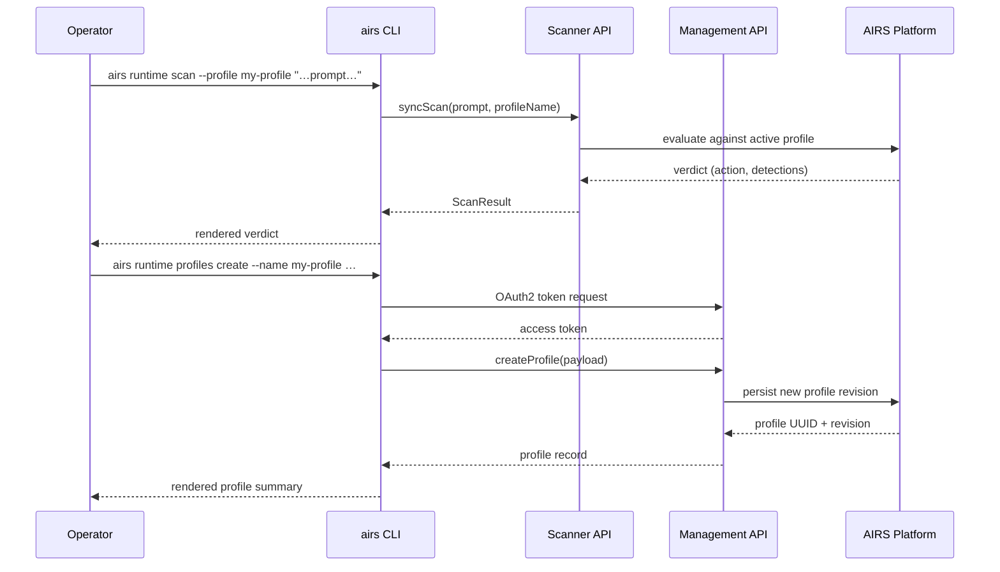

# How Prisma AIRS Works

Prisma AIRS (AI Runtime Security) is Palo Alto Networks' platform for securing AI applications at
runtime. It inspects every prompt and response flowing through your AI applications, enforces
guardrails you configure, and gives you tooling to validate and improve those guardrails over time.

The `airs` CLI is your operational interface to the entire platform. You use it to scan prompts,
manage security profiles and custom topics, run red team exercises, check ML model supply chain
health, and test DLP detection — without writing a line of code.

---

## The Two API Planes

The platform exposes two distinct API planes, and the CLI uses both. Knowing which credentials each
plane needs prevents most authentication failures.

| Plane | Purpose | Required Credentials |
|-------|---------|---------------------|
| **Scanner API** | Real-time prompt/response scanning | `PANW_AI_SEC_API_KEY` |
| **Management API** | Profile/topic configuration, red team, model security, DLP | `PANW_MGMT_CLIENT_ID` + `PANW_MGMT_CLIENT_SECRET` + `PANW_MGMT_TSG_ID` |

!!! note "Guardrail optimization and profile audits need both planes"
    Guardrail generation (`topics create/apply/eval/revert`) and profile audits
    (`profiles audit`) call the Management API to read and write configuration, and the Scanner API
    to evaluate prompts. They also require an LLM provider key (e.g. `ANTHROPIC_API_KEY`) to
    generate test prompts.

The config cascade resolves credentials in priority order:
```
CLI flags  >  environment variables  >  ~/.prisma-airs/config.json  >  defaults
```

---

## Request Flow



---

## How the Functional Areas Connect

Think of a normal workflow as a loop with four stages:

1. **Configure** — create a security profile and add custom topics that describe threats your
   application faces (`airs runtime profiles create`, `airs runtime topics create`).
2. **Scan** — run prompts through the profile in real time to see whether guardrails are
   triggering correctly (`airs runtime scan`).
3. **Validate** — run adversarial red team exercises against your live endpoints to find gaps
   between your guardrails and real attack coverage (`airs redteam scan`).
4. **Harden** — check your ML model supply chain for vulnerabilities that could affect the
   models powering your application (`airs model-security scans create`).

DLP detection sits alongside these four stages: it intercepts sensitive data patterns in prompts
and responses independently of topic guardrails, acting as a parallel detection layer.

The guardrail optimization loop fits inside stage 1–2: an automated agent iterates
`topics create → topics apply → topics eval → (keep or revert)` until your topic achieves the
accuracy target you set.

---

## Getting the Most Out of Each Area

### Runtime Security

The Scanner API accepts a single prompt for sync scanning or a batch file for async bulk scanning.
Always scan by **profile name** (not UUID) — the platform resolves names to the latest active
revision automatically, so your scans stay current as profiles evolve.

See [Runtime Security](../runtime/overview.md) for scanning, config management, and scan log
querying.

### Guardrail Optimization

Custom topics are the primary mechanism for tuning AIRS to your application's threat model.
Each topic is a short description (≤ 250 bytes) plus up to 5 examples (each ≤ 250 bytes, combined
total ≤ 1,000 bytes). Shorter, focused descriptions consistently outperform long descriptions with
exclusion clauses — start small and iterate.

!!! tip "Use the autoresearch loop for topic tuning"
    The four atomic topic commands (`create`, `apply`, `eval`, `revert`) are designed to be driven
    by an agent loop. Run `topics eval` against a static prompt set to get TP/TN/FP/FN metrics,
    then decide to keep or revert before the next iteration.

See [Guardrail Optimization](../runtime/guardrails/overview.md) for the iteration protocol and
metrics reference.

### Profile Audits

A profile audit evaluates every topic in a profile in a single pass. It generates test prompts for
each topic, scans them, computes per-topic and composite TPR/TNR/F1 scores, and detects conflicts
between topics (where the same prompt is a false negative for one topic and a false positive for
another).

Run audits whenever you add new topics or after bulk topic updates to catch regressions before
they reach production.

See [Profile Audits](../runtime/profile-audits.md) for the full workflow.

### AI Red Teaming

Red team scans attack a live endpoint using an attack library (STATIC), agent-driven probing
(DYNAMIC), or a custom prompt set (CUSTOM). Use red team exercises to validate that your AIRS
profile blocks real attack patterns — not just the examples you wrote by hand.

See [AI Red Teaming](../redteam/overview.md) for target setup, scan types, and report generation.

### Model Security

Model security groups let you define which ML models are allowed in your environment and apply
rules (blocking or allowing) by source (local, S3, GCS, Azure, Hugging Face). Scans surface
vulnerabilities in the models themselves, independent of runtime prompt behavior.

See [Model Security](../model-security/overview.md) for group and rule management.

### DLP Detection

DLP detection runs in parallel with topic guardrails. You configure DLP profiles, patterns, and
dictionaries through the `airs runtime dlp` subcommands, then test detection against real or
synthetic prompts.

See [DLP Detection Testing](../dlp-detection/index.md) for pattern authoring and profile setup.

### Full Command Reference

For a complete listing of every command, flag, and option, see the [CLI Reference](../cli/index.md).
